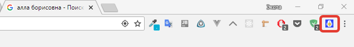
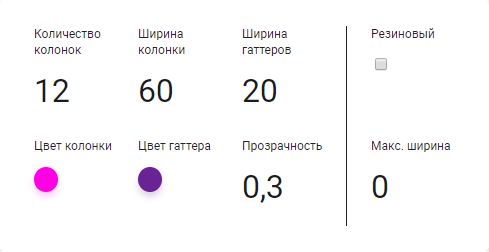
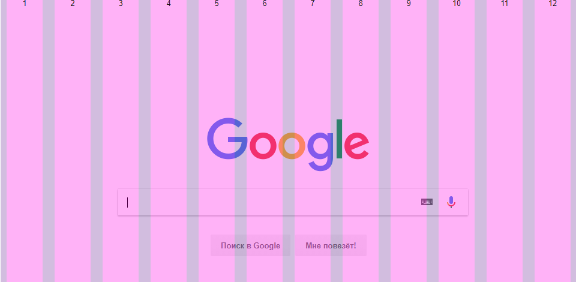

# Grid overlay
Накладывает сетку на сайт для тестирования верстки.

Grid overlay это расширения для google chrome.

## Преимущества
* Доступно (a11y)
* Семантично
* Использует нативные контролы
* Пресеты популярных сеток
  * 960grid
  * 8 point grid
* Вертикальный ритм

## Использование
1. Установить из магазина Google Chrome

2. Нажать на иконку

3. Пользоваться

## Способы использования
### Числовые инпуты
Значения в числовых инпутах можно менять с помощью:
1. стрелок на клавиатуре
2. колёсика на мышке. Для этого кликни на необходимый инпут и начинай скролить колёсико на мышке

### Навигация по всем полям
Происходит с помощью мышки, но также можно с помощью `tab` на клавиатуре

### Переводы
* русский
* английский
* итальянский
